<div align="center">

# `logivoid@dev`

### Computer Engineering • UAV Systems • Autonomous Robotics • AI Automation • Blockchain Research


</div>

---

<div align="center">



</div>

---

## `> whoami`

Computer Engineering student focused on **UAV systems, embedded engineering, autonomous robotics, blockchain infrastructure research, and AI-driven engineering workflows**.

I work across hardware-software systems: embedded control, sensor integration, flight stabilization, robotics architectures, database-backed applications, and experimental distributed-systems research.

```python
logivoid = {
    "name": "Ahmad Hassan",
    "field": "Computer Engineering",
    "focus": [
        "UAV Systems",
        "Autonomous Robotics",
        "Embedded Systems",
        "AI Automation",
        "Blockchain / MEV Research"
    ],
    "status": "building",
    "location": "Lebanon"
}
```

---

## `> technical_stack`

<div align="center">

### Languages


### Embedded / Robotics


### Application Development


### Engineering / Research


</div>

---

## `> engineering_capabilities`

```text
[01] UAV Systems & Autonomous Robotics
[02] Embedded Systems & Flight Control
[03] Sensor Fusion & Real-Time Systems
[04] PID Control & Flight Stabilization
[05] ESP32-Based Embedded Development
[06] REST APIs & JSON Integration
[07] MongoDB, SQL & Database Design
[08] AI Automation Workflows
[09] MEV & Blockchain Research
[10] Technical Research & Rapid Prototyping
```

---

## `> current_focus`

```text
UAV_CONTROL       developing embedded flight-control architectures
ROBOTICS          designing transformable aerial-terrestrial systems
AUTONOMY          sensor integration, state logic and stabilization
AI_AUTOMATION     engineering workflow automation and intelligent tools
BLOCKCHAIN        quantum-assisted MEV mitigation research
SOFTWARE          mobile applications, APIs and database-backed systems
```

---

## `> github_telemetry`

<div align="center">


</div>

---

## `> contribution_stream`

<div align="center">

`CONTRIBUTION_FEED // LIVE`

<br>

<picture>
  <source
    media="(prefers-color-scheme: dark)"
    srcset="https://raw.githubusercontent.com/logivoid/logivoid/output/github-contribution-grid-snake-dark.svg"
  />
  <source
    media="(prefers-color-scheme: light)"
    srcset="https://raw.githubusercontent.com/logivoid/logivoid/output/github-contribution-grid-snake.svg"
  />
  
</picture>

<br>


</div>

---

## `> languages`

```text
Arabic     Native
English    Fluent
German     Intermediate
```

---

## `> connect`

<div align="center">

[](https://github.com/logivoid)
[](mailto:ahmxdhn@gmail.com)

<!-- Add your exact LinkedIn URL here when ready:
[](YOUR_LINKEDIN_URL)
-->

</div>

---

<div align="center">

```text
logivoid@dev:~$ build --research --iterate --ship
```

<sub>ENGINEERING / AUTONOMY / INTELLIGENCE</sub>

</div>
